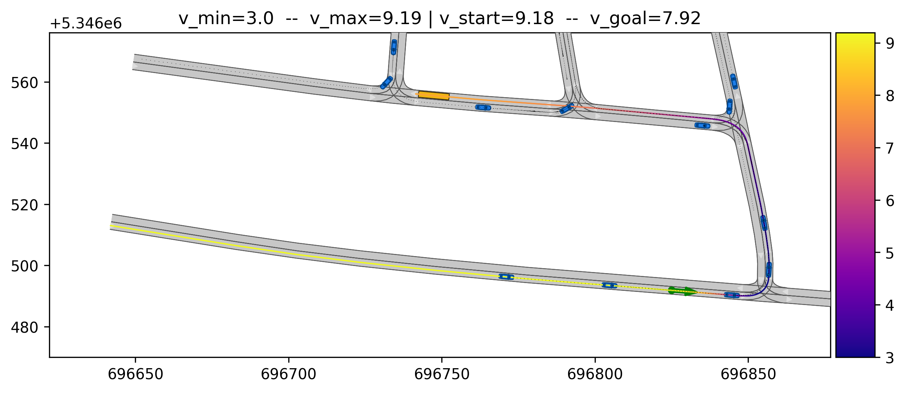
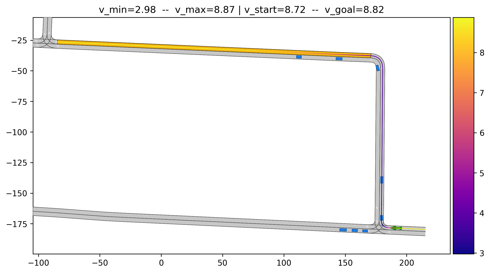
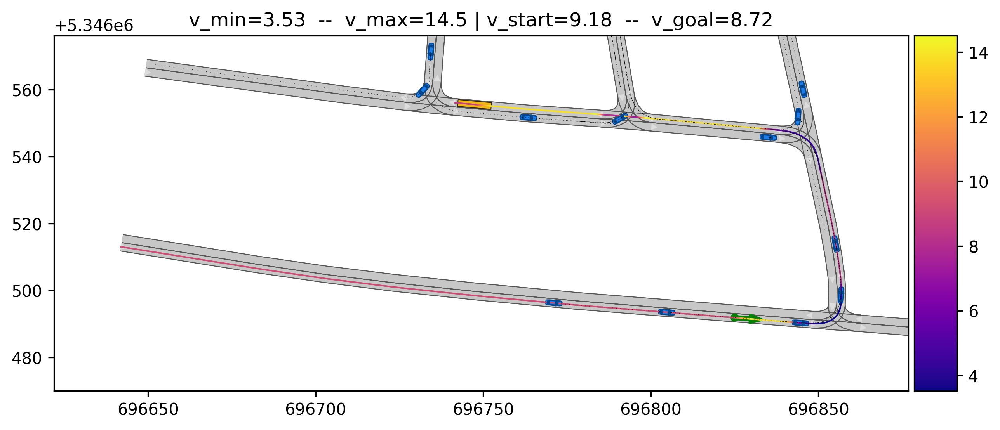
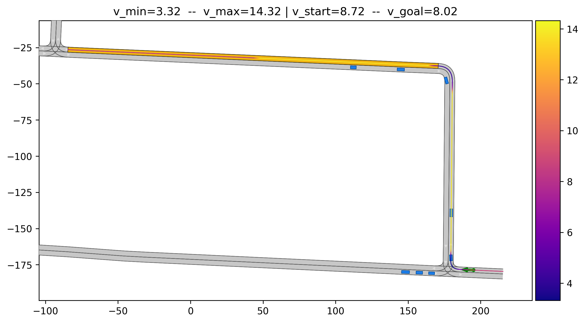

# CommonRoad Velocity Planner

The commonroad velocity planner implements several velocity profile planners for generating global reference trajectories (mission planning)
used for guiding local planners, such as the commonroad-reative-planner.
It uses a reference path, for example generated by the commonroad-route-planner, and assigns each point a reference trajectory.
If provided, the planner also aims at keeping the speed limit of each lanelet.
We provide both a planner based on convex optimization as well as one based on the race line generation based on bang-bang-control.

The linear program planner is based on the work of Shimizu et al. [1,2] and the default solver is CLARABEL [2], although GUROBI [3]
is also supported. We use cvxpy [4] as an interface to various solvers. Our linear program planner minimizes the jerk and, thus, is
rather conservative and tailored towards riding comfort. The LP approach is based on the QP approach [7].

The velocity profile planner using bang-bang-control is based on the work of Velenis and Triotras [6] with adaptations to on-road driving. 
Nonetheless, this planner is rather aggressive and tailored towards minimal travelling time, therefore generating much higher velocity values. 
Note that this planner requires model parameters
for a dynamic single track model. As an advantage, this planner has a faster execution time and does not rely on a solver, thus not experiencing
solver infeasibility and numerical instability.

The approach based on quadratic programming is based open the work of Zhang et al. [7] with minimal adaptions regarding slack variables. 
This planner is more aggressive than the linear program [1] as the QP is not jerk-optimal. From our experience, the qp planner
is a bit slower than the LP planner.

## Example
The color coding is always relative to the minimum and maximum values in the current velocity profile in mps.

### Linear Program Planner

### Bang-Bang-Control Planner

### Quadratic Program Approach

## Default Configuration
The default configuration uses a linear programming approach and **constraint relaxation** to facility feasibility over various scenarios.
Thus, acceleration, jerk and velocity limits may be broken (only) when infeasibility would result otherwise.
If no explicit goal is given, the planner reaches the desired velocity at the end of the goal lanelet.
If a goal position but no goal velocity is given, the planner uses the initial velocity as goal velocity.

## References
- [1] Y. Shimizu, T. Horibe, F. Watanabe and S. Kato, "Jerk Constrained Velocity Planning for an Autonomous Vehicle: Linear Programming Approach," 2022 International Conference on Robotics and Automation (ICRA), Philadelphia, PA, USA, 2022, pp. 5814-5820.
- [2] Y. Shimizu, T. Horibe, F. Watanabe and S. Kato: Code for their paper, https://github.com/pflab-ut/jerk_optimal_velocity_planning, last access 22nd of July 2024
- [3] P. J. Goulart and Y. Chen, "Clarabel: An interior-point solver for conic programs with quadratic objectives", 2024, arXiv:2405.12762
- [4] GUROBI Website, https://www.gurobi.com/, 2024, last access 22nd of July 2024
- [5] cvxpy documentation,  https://www.cvxpy.org/, 2024, last access 22nd of July 2024
- [6]  E. Velenis and P. Tsiotras, "Optimal velocity profile generation for given acceleration limits: Theoretical analysis". In Proceedings of the 2005, American Control Conference, 2005, (pp. 1478-1483).
- [7] Zhang, Y., Chen, H., Waslander, S. L., Yang, T., Zhang, S., Xiong, G., & Liu, K. (2018). Toward a more complete, flexible, and safer speed planning for autonomous driving via convex optimization. Sensors, 18(7).

## Authors
- Tobias Mascetta: tobias.mascetta[at]tum.de,
- Kilian Northoff: kilian.northoff[at]tum.de
